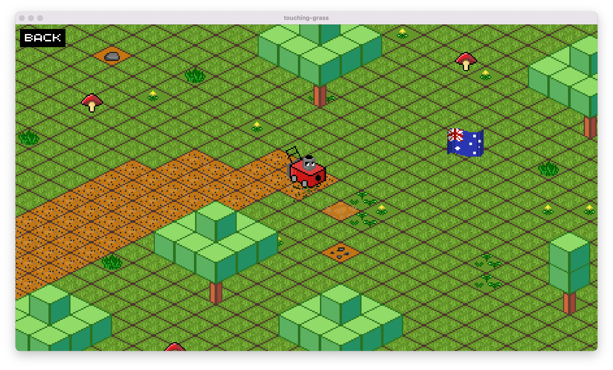

# Touching Grass
_a.k.a. **Super Lawn Mower RPG**_

A lawn-mower simulator game built for the 2023 DEVSxGDSC Hackathon.

Winner of the "Most Creative" category.

## The Team
Touching Grass was created by:
 - **Technical Lead/Engine:** Matthew Jakeman ([@mjakeman](https://github.com/mjakeman/))
 - **Pixel Art/Gameplay:** Bryan Liu ([@bliu631](https://github.com/bliu631/))
 - **Map Designer/Programmer:** Nilay Setiya ([@nset793](https://github.com/nset793))
 - **Art/Programmer:** Jordan York ([@jordanyork07](https://github.com/jordanyork07))

Honourary mention:
 - **Moral Support (had covid :/):** Jaskaran Sandhu ([@jsan956-ai](https://github.com/jsan956-ai))

## FAQ
### Why make a lawnmower sim?
The theme was [_Touching Grass_](https://www.urbandictionary.com/define.php?term=Touching%20Grass).

We interpreted this is literally as possible.

### What is this made in?
This is made in pure Java using libGDX.

It uses an isometric pseudo-3d engine that was made from scratch during the Hackathon.

### How long did it take you?
The project was completed in a weekend. In total, it was probably around 12 hours of work for four people.

## Attribution
We used some awesome free resources as part of the game:
 - [Isometric Tiles Template for 32x32 pixel art](https://route1rodent.itch.io/isometric-sandbox-pixel-world-32x32)
 - Music and sound effects are from YouTube